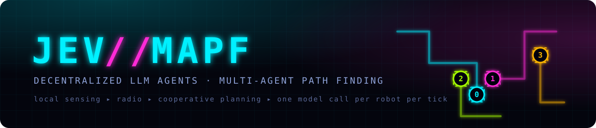
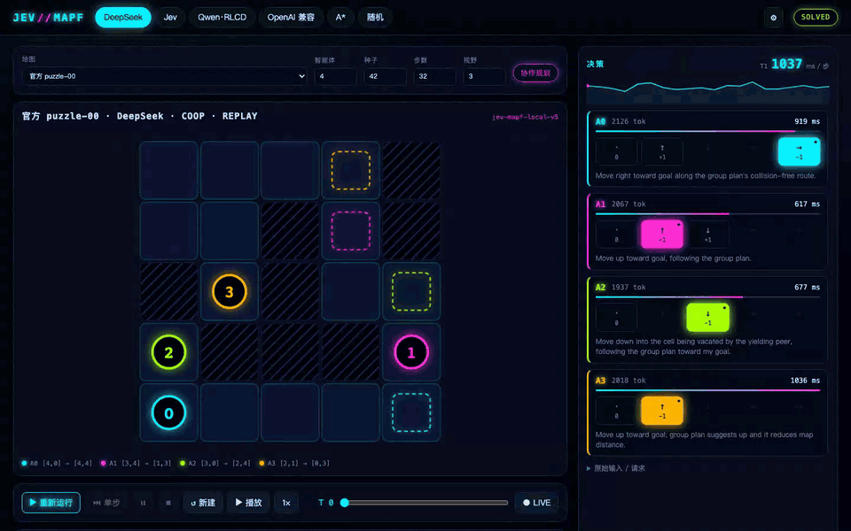

<div align="center">



### Let an LLM drive a crowd of robots through a maze without blocking each other.

**🗺️ 149 maps out of the box · 🧠 Cloud APIs or a local small model · 🎮 Every choice visible**

No GPU, no training. Install, open the browser, and watch each robot look around, pick a move and go.

[](https://github.com/Fibonaccirabbit/Jev-MAPF/actions/workflows/test.yml) [](LICENSE) [](https://www.python.org/) [](https://github.com/Cognitive-AI-Systems/pogema)

**English** · [简体中文](README.zh-CN.md)

[🚀 Quick start](#-quick-start) · [🧠 Connect a model](#-connect-a-model) · [📊 Results](#-results) · [🔧 Tinker](#-tinker)



<sub>DeepSeek × cooperative planning · official <code>puzzle-00</code> · 4 robots · solved in 20 steps · right panel: each robot's latency, tokens and candidates, tick by tick</sub>

If it saved you an afternoon of setup, a ⭐ Star is welcome.

</div>

## ✨ What you can do

- 🗺️ **Play first, plug in a model later** — A\* and random baselines run the full loop with no API key, and the bundled replays play right away.
- 🧠 **Model setup lives in the UI** — DeepSeek, TypeSafe Jev, local Qwen RLCD, any OpenAI-compatible endpoint: fill it in, hit test.
- 👀 **Watch the decisions** — per robot, per tick: latency, tokens, five candidate moves and the one taken, with probability bars when the API returns them.
- 🎚️ **Three switches for difficulty** — own-map distance, short-range radio, cooperative planning; turn them on one at a time and watch the change.
- ⏯️ **Drive the experiment** — run, step, pause, stop, timeline scrubbing, playback speed, JSON export.
- 📦 **Replays included** — 9 runs in the package, showing both clean solves and deadlocks.

## 🎯 149 maps, four robots

| Map set | What you'll see |
| --- | --- |
| 🧩 puzzle (16) | 5×5 tight corridors where someone has to back into a pocket, or everyone jams |
| 🌀 maze (128) | 21×21 mazes: detours and long-range navigation |
| 🏭 warehouse (1) | 33×46 shelf aisles |
| 🔰 debug scenes (4) | Crossing, passing bay, four rooms, random obstacles — good for a first look |

Robots keep occupying their goal cell after arriving and can step off to let others pass. That's classical MAPF, and it's where the traffic jams come from.

## 🚀 Quick start

**You need Python 3.11+ and Git.** No GPU, no frontend build.

### 1️⃣ Clone

```bash
git clone https://github.com/Fibonaccirabbit/Jev-MAPF.git
cd Jev-MAPF
```

### 2️⃣ Install and serve

```bash
python3 -m venv .venv
.venv/bin/pip install -e '.[test]'
.venv/bin/jev-mapf serve --port 8091
```

### 3️⃣ Open the page and run one

Go to **[http://127.0.0.1:8091](http://127.0.0.1:8091)** → click any replay at the bottom, or pick the **A\*** baseline and press ▶ run. 🎉

Drag the timeline to revisit any tick; the right panel follows, showing what each robot saw and chose there.

> 💡 A\* and random make no model calls. With a model connected, every robot makes one call per tick.

## 🧠 Connect a model

| Option | Good for | You need |
| --- | --- | --- |
| 🎮 A\* · random | Looking around first | Just the install |
| 🔵 DeepSeek | You have a DeepSeek key | API key |
| ⚡ TypeSafe Jev | Invited TypeSafe users | Official API key |
| 🍎 Local Qwen2.5-1.5B RLCD | 4-bit constrained decoding on Apple Silicon | The local Qwen RLCD service running |
| 🌐 OpenAI-compatible | Any cloud or local endpoint you already use | Endpoint, model ID, API key |

Click **⚙** in the top bar → endpoint, model ID, key → save → **test**. A passing test shows the model name and latency from the response.

| Model | `--provider` | Environment |
| --- | --- | --- |
| DeepSeek | `deepseek` | `DEEPSEEK_API_KEY` · `DEEPSEEK_MODEL` |
| TypeSafe Jev | `jev` | `TYPESAFE_API_KEY` · `JEV_MAX_ATTEMPTS` |
| Qwen RLCD | `qwen_rlcd` | `QWEN_RLCD_URL` (default `http://127.0.0.1:8000/api/run-rlcd`) |
| OpenAI-compatible | `chat` | `MAPF_API_URL` · `MAPF_API_MODEL` · `MAPF_API_KEY` |

DeepSeek and Jev are pinned to their official endpoints. DeepSeek defaults to low thinking with an 8192-token budget; on puzzles `--no-thinking --max-tokens 1024` is faster and cheaper. Jev retries failed connections up to `JEV_MAX_ATTEMPTS`.

## 🔄 How it works

```text
  each robot, every tick, in parallel and isolated
  +--------------------------------------------------------------------+
  |  7x7 sensors -> private memory -> local facts -> <=5 moves -> MODEL |
  +--------------------------------------------------------------------+
        ^                                ^
        | radio . range r                | coop planner . range 2r . opt-in
        | priority + wanted cell         | pooled maps + goals -> joint A*
        +----------------+---------------+
                         |
                         v
      POGEMA synchronous step   (soft collisions, no swaps)
```

A robot sees a 7×7 window at radius 3, plus the map it has walked and its last 8 outcomes, and picks one of at most 5 one-step moves. Once every robot has answered, POGEMA executes them together. Three switches decide what else a robot knows:

| Switch | Default | What the robot also gets | Code |
| --- | :-: | --- | --- |
| **Own-map distance** | on | How many steps each candidate cell is from its goal across the map *it* has seen; unknown cells count as open | `perception.py` |
| **Short-range radio** | on | Neighbors' priority and the cell each wants next, so it can tell who yields | `comms.py` |
| **Cooperative planner** | off | Robots in radio range form a group, pool maps and goals, search jointly and suggest this tick's step | `planner.py` |

<details>
<summary>💡 Why a cooperative planner?</summary>

<br>

Two robots meeting head-on in a corridor run the same rule, so they step aside together and come back together until the step limit runs out. The radio's priority breaks part of that symmetry, but these puzzles want several steps of lookahead — back into the pocket, wait there while the other passes — and a reactive rule tops out around PIBT. The planner lets a group within radio range run one joint search and offers the first step as a suggestion. Goals are shared inside the group, so those runs are reported separately as "decentralized + cooperative planning".

</details>

## 📊 Results

16 official puzzles, 4 robots, seed 42, 32-step limit. An exhaustive joint-state search finds 15 of them solvable (`puzzle-06` is not).

```text
  independent A*        ████░░░░░░░░░░░░   4/16   ISR 0.69
  DeepSeek · solo       ███░░░░░░░░░░░░░   3/16   ISR 0.66
  DeepSeek · coop       ███████████████░  15/16   ISR 0.97   all optimal
  Jev      · coop       ███████████████░  15/16   ISR 0.94   all optimal
  Qwen 1.5B · coop      ░░░░░░░░░░░░░░░░   0/16   ISR 0.12
```

| | DeepSeek × coop | Jev × coop |
| --- | --: | --: |
| Solved (all at optimal length) | **15 / 16** | **15 / 16** |
| Plan suggestions followed | 516 / 516 | 516 / 516 |
| Median latency per call | 728 ms | 590 ms |
| Tokens over 16 maps | 1.52 M | 1.51 M |

Puzzles test multi-step cooperative yielding, and independent A\*, PIBT and step-by-step LLM decisions all stall at 3–5. Qwen 1.5B speaks the protocol fine but barely follows the distance signal, oscillating between two cells from the first tick.

Full runs, failure mechanisms, intermediate versions and network incidents: **[experiment log](EXPERIMENTS.md)**.

## 🖥️ CLI

```bash
# baseline
jev-mapf run --case puzzle-03 --provider astar --num-agents 4

# DeepSeek × cooperative planning
DEEPSEEK_API_KEY=sk-... jev-mapf run --case puzzle-00 --provider deepseek \
  --no-thinking --max-tokens 1024 --num-agents 4 --max-steps 32 --coop-planner

# Jev on an official maze, key from hidden input
jev-mapf run --case validation-mazes-seed-000 --provider jev --num-agents 4 --max-steps 96 --key-stdin

# bundle a run as a replay in the UI
jev-mapf preset outputs/<run-id> --name my-run --title "DeepSeek × coop · puzzle-00"
```

Flags: `--seed` · `--max-steps 1–256` · `--num-agents 1–16` · `--obs-radius 1–5` · `--coop-planner` · `--no-thinking` · `--max-tokens` · `--key-stdin`.

Every run lands in `outputs/<run-id>/`: `result.json` (config, map provenance, per-frame state, each robot's input and candidates, requests and responses, latency, choice, outcome), `animation.svg`, `replay.html`. CSR is whether everyone arrived this run, ISR the share on their goals at the end, SoC and makespan come from POGEMA.

## 🔧 Tinker

Swap maps, add robots and change the sensor radius from the page. To add a model or rework the prompt, start here:

| File | Does what |
| --- | --- |
| `decentralized.py` | Per-robot memory, candidates, prompt, concurrent requests |
| `perception.py` · `comms.py` · `planner.py` | The three information layers |
| `policies.py` | Provider protocols and baselines |
| `runtime.py` | POGEMA loop and record keeping |
| `server.py` · `web/` | Workbench API and the neon UI (vanilla JS, no build) |

```bash
.venv/bin/python -m pytest -q
npm i --no-save playwright && npx playwright install chromium
node tests/ui_smoke.cjs      # browser smoke: replays + A*
```

## 🗺️ Roadmap

- [x] 149 maps, local observation, independent decisions, synchronous execution
- [x] DeepSeek / Jev / Qwen RLCD / OpenAI-compatible providers
- [x] Own-map distance, short-range radio, cooperative planning
- [x] Neon workbench: per-tick decision panel, timeline replay, bundled runs
- [x] Three models measured across 16 puzzles
- [ ] Full runs on the maze and warehouse maps
- [ ] Success rates over multiple seeds
- [ ] Cooperative planning at 8–16 robots

## 🤝 Contributing

⭐ Star, 🍴 Fork, and issues or PRs are all welcome — new providers, reproduced failures, more maps, UI work.

[🐛 Issues](https://github.com/Fibonaccirabbit/Jev-MAPF/issues) · [🛠️ Pull requests](https://github.com/Fibonaccirabbit/Jev-MAPF/pulls)

When you post results, include the model, map, seed and config. Failures are worth recording too.

## 🙏 Credits and license

Simulation environment and the A\* baseline come from [POGEMA](https://github.com/Cognitive-AI-Systems/pogema) (MIT); bundled maps keep their license and provenance in [`src/jev_mapf/maps/`](src/jev_mapf/maps/). Original code is **[MIT](LICENSE)**.
